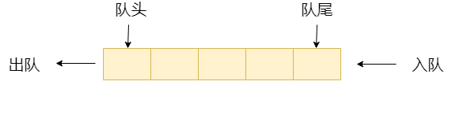

#数据结构与算法
#[数据结构]()
###[稀疏数组sparsearray]()
###[队列]()
+ 先进先出( FIFO，First In, First Out) 的线性表， 可以用数组或是链表来实现。
+ 队列只允许在后端（rear）进行插入操作也就是 入队 enqueue，在前端（front）进行删除操作也就是出队 dequeue
+ 示意图： (使用数组模拟队列示意图)
  

  
  
  ```）
  假设队列中有n个元素。
  访问：O（n）//最坏情况
  插入删除：O（1）//后端插入前端删除元素
  ```
###[环形队列](./docs/md/cycleArrayQueue.md)
 