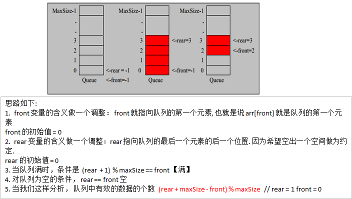

 #[环形队列（数组实现）]()

  大家可以通过下面的动图了解下环形队列：

 


 

 ###思路分析：
+ maxSize ：队列容量（数组的长度）
+ arr ：模拟队列的数组
+ front ：指向队列头部元素，初始值为 0
+ rear ：指向队列尾部元素的后一个元素，初始值为 0

 

###基本操作：
+ 队列判空：front == rear
+ 队列判满：
  
   + 为何要在 rear 之后，front 之前空出一个元素的空间？因为如果不空出一个元素，队列判空条件为：front == rear ，队列判满的条件也是：front == rear ，有歧义！
    + 队列容量：因为空出了一个元素，所以队列容量就变成了 (maxSize - 1)
    + 当空出一个元素的空间，如何判满？当还剩一个元素时，队列就已经满了，所以判断条件为 (rear + 1) % maxSize == front
    

+ 队列元数个数：
    + 计算公式：(rear + maxSize - front) % maxSize ，这样来思考：
    + 当 rear 比 front 大时，即 (rear -front) > 0 ，这时还没有形成环形结构，(rear -front) 即是队列元素个数
    + 当 rear 比 front 小时，即 (rear -front) < 0 ，这时已经形成了环形结构，(rear -front) 表示数组还差多少个元素存满（负数），(rear + maxSize - front) 即是队列元素个数
    + 综上：(rear + maxSize - front) % maxSize
    

+ 队列入队：
  + 首先，队列不满才能入队
  + 由于 rear 指向队列尾部元素的后一个元素，所以直接设置即可： arr[rear] = value
  + 接下来，rear 应该向后移动一个位置：rear = (rear + 1) % maxSize
  + 取模是为了防止数组越界，让指针从新回到数组第一个元素
    

+ 队列出队：
  + 首先，队列不空才能出队
  + 由于 front 直接指向队列头部元素，所以直接返回该元素即可：int value = arr[front ]
  + 接下来，front 应该向后移动一个位置：front = (front + 1) % maxSize
  + 取模是为了防止数组越界，让指针从新回到数组第一个元素


  ###代码实现：
```aidl
class CircleArray {
	private int maxSize; // 表示数组的最大容量
	// front 变量的含义做一个调整： front 就指向队列的第一个元素, 也就是说 arr[front] 就是队列的第一个元素
	// front 的初始值 = 0
	private int front;
	// rear 变量的含义做一个调整：rear 指向队列的最后一个元素的后一个位置. 因为希望空出一个空间做为约定.
	// rear 的初始值 = 0
	private int rear; // 队列尾
	private int[] arr; // 该数据用于存放数据, 模拟队列

	public CircleArray(int arrMaxSize) {
		maxSize = arrMaxSize;
		arr = new int[maxSize];
	}

	// 判断队列是否满
	public boolean isFull() {
		return (rear + 1) % maxSize == front;
	}

	// 判断队列是否为空
	public boolean isEmpty() {
		return rear == front;
	}

	// 添加数据到队列
	public void addQueue(int n) {
		// 判断队列是否满
		if (isFull()) {
			System.out.println("队列满，不能加入数据~");
			return;
		}
		// 直接将数据加入
		arr[rear] = n;
		// 将 rear 后移, 这里必须考虑取模
		rear = (rear + 1) % maxSize;
	}

	// 获取队列的数据, 出队列
	public int getQueue() {
		// 判断队列是否空
		if (isEmpty()) {
			// 通过抛出异常
			throw new RuntimeException("队列空，不能取数据");
		}
		// 这里需要分析出 front是指向队列的第一个元素
		// 1. 先把 front 对应的值保留到一个临时变量
		// 2. 将 front 后移, 考虑取模
		// 3. 将临时保存的变量返回
		int value = arr[front];
		front = (front + 1) % maxSize;
		return value;

	}

	// 显示队列的所有数据
	public void showQueue() {
		// 遍历
		if (isEmpty()) {
			System.out.println("队列空的，没有数据~~");
			return;
		}
		// 思路：从front开始遍历，遍历多少个元素
		// 动脑筋
		for (int i = front; i < front + size(); i++) {
			System.out.printf("arr[%d]=%d\n", i % maxSize, arr[i % maxSize]);
		}
	}

	// 求出当前队列有效数据的个数
	public int size() {
		// rear = 2
		// front = 1
		// maxSize = 3
		return (rear + maxSize - front) % maxSize;
	}

	// 显示队列的头数据， 注意不是取出数据
	public int headQueue() {
		// 判断
		if (isEmpty()) {
			throw new RuntimeException("队列空的，没有数据~~");
		}
		return arr[front];
	}
}
————————————————
版权声明：本文为CSDN博主「OnebyWang」的原创文章，遵循CC 4.0 BY-SA版权协议，转载请附上原文出处链接及本声明。
原文链接：https://blog.csdn.net/oneby1314/article/details/107584566
```


###代码测试：

```aidl
public class CircleArrayQueueDemo {

	public static void main(String[] args) {

		// 测试一把
		System.out.println("测试数组模拟环形队列的案例~~~");

		// 创建一个环形队列
		CircleArray queue = new CircleArray(4); // 说明设置4, 其队列的有效数据最大是3
		char key = ' '; // 接收用户输入
		Scanner scanner = new Scanner(System.in);//
		boolean loop = true;
		// 输出一个菜单
		while (loop) {
			System.out.println("s(show): 显示队列");
			System.out.println("e(exit): 退出程序");
			System.out.println("a(add): 添加数据到队列");
			System.out.println("g(get): 从队列取出数据");
			System.out.println("h(head): 查看队列头的数据");
			System.out.println();
			key = scanner.next().charAt(0);// 接收一个字符
			switch (key) {
			case 's':
				queue.showQueue();
				break;
			case 'a':
				System.out.println("输出一个数");
				int value = scanner.nextInt();
				queue.addQueue(value);
				break;
			case 'g': // 取出数据
				try {
					int res = queue.getQueue();
					System.out.printf("取出的数据是%d\n", res);
				} catch (Exception e) {
					// TODO: handle exception
					System.out.println(e.getMessage());
				}
				break;
			case 'h': // 查看队列头的数据
				try {
					int res = queue.headQueue();
					System.out.printf("队列头的数据是%d\n", res);
				} catch (Exception e) {
					// TODO: handle exception
					System.out.println(e.getMessage());
				}
				break;
			case 'e': // 退出
				scanner.close();
				loop = false;
				break;
			default:
				break;
			}
		}
		System.out.println("程序退出~~");
	}

}


```

###程序运行结果：
```aidl
测试数组模拟环形队列的案例~~~
s(show): 显示队列
e(exit): 退出程序
a(add): 添加数据到队列
g(get): 从队列取出数据
h(head): 查看队列头的数据

a
输出一个数
1
s(show): 显示队列
e(exit): 退出程序
a(add): 添加数据到队列
g(get): 从队列取出数据
h(head): 查看队列头的数据

a
输出一个数
2
s(show): 显示队列
e(exit): 退出程序
a(add): 添加数据到队列
g(get): 从队列取出数据
h(head): 查看队列头的数据

a
输出一个数
3
s(show): 显示队列
e(exit): 退出程序
a(add): 添加数据到队列
g(get): 从队列取出数据
h(head): 查看队列头的数据

s
arr[0]=1
arr[1]=2
arr[2]=3
s(show): 显示队列
e(exit): 退出程序
a(add): 添加数据到队列
g(get): 从队列取出数据
h(head): 查看队列头的数据

a
输出一个数
4
队列满，不能加入数据~
s(show): 显示队列
e(exit): 退出程序
a(add): 添加数据到队列
g(get): 从队列取出数据
h(head): 查看队列头的数据

g
取出的数据是1
s(show): 显示队列
e(exit): 退出程序
a(add): 添加数据到队列
g(get): 从队列取出数据
h(head): 查看队列头的数据

g
取出的数据是2
s(show): 显示队列
e(exit): 退出程序
a(add): 添加数据到队列
g(get): 从队列取出数据
h(head): 查看队列头的数据

s
arr[2]=3
s(show): 显示队列
e(exit): 退出程序
a(add): 添加数据到队列
g(get): 从队列取出数据
h(head): 查看队列头的数据

g
取出的数据是3
s(show): 显示队列
e(exit): 退出程序
a(add): 添加数据到队列
g(get): 从队列取出数据
h(head): 查看队列头的数据

g
队列空，不能取数据
s(show): 显示队列
e(exit): 退出程序
a(add): 添加数据到队列
g(get): 从队列取出数据
h(head): 查看队列头的数据

```